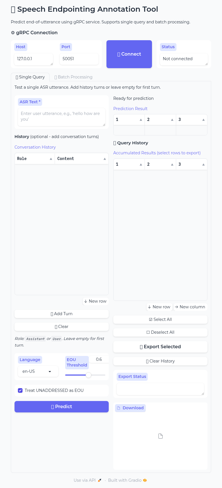
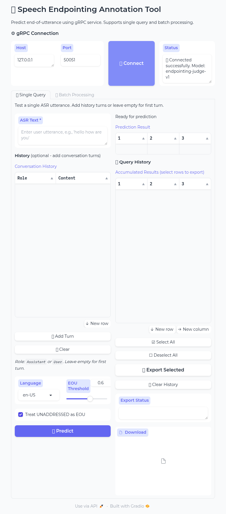
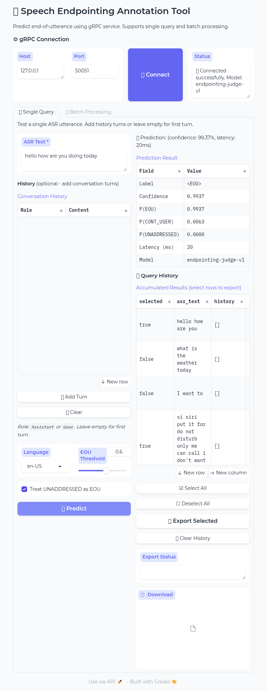
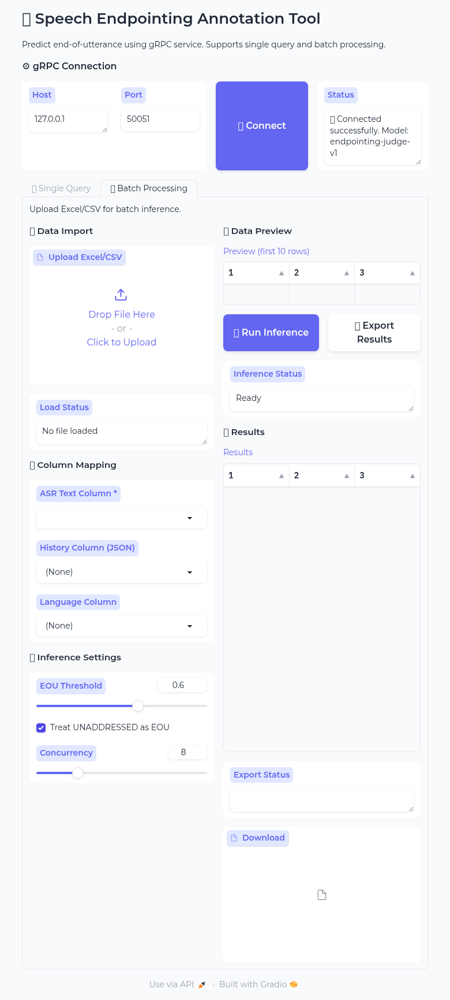

# 🎙️ 语音端点检测标注工具

基于 Gradio 的语音端点检测标注 WebUI，支持**单条查询测试**和**批量处理** ASR 转录文本，通过 gRPC 服务预测用户是否说完（End-of-Utterance）。



## ✨ 功能特性

### 🔍 单条查询
- **实时预测** - 对单条 ASR 语句进行即时推理
- **对话历史支持** - 支持多轮对话场景
- **结果累积** - 每次预测自动保存到历史记录
- **选择性导出** - 可选择需要导出的结果行
- **全选/取消全选** - 批量操作按钮

### 📊 批量处理
- **Excel/CSV 导入** - 自动检测列映射
- **并发推理** - 可配置并行数
- **进度追踪** - 批量处理时显示进度
- **导出到 Excel** - 包含所有推理结果

### ⚙️ 通用功能
- **gRPC 集成** - 连接 `endpointing.v1.EndpointingService`
- **多语言支持** - 支持 `en-US`、`zh-CN`、`fr-FR` 等
- **阈值可配置** - 调整 EOU 决策阈值
- **UNADDRESSED 处理** - 可选是否将其视为 EOU

---

## 🚀 快速开始

### 环境要求
- Python 3.10+
- 运行中的 gRPC 服务端 `endpointing.v1.EndpointingService/Predict`

### 🪟 Windows 一键安装（推荐小白用户）

**只需双击一个文件，自动完成所有安装！**

1. 下载整个 `endpointing_webui` 文件夹到电脑
2. 双击 **`一键启动.bat`**
3. 等待自动安装完成，浏览器会自动打开

**一键启动运行效果：**

```
╔══════════════════════════════════════════════════════════════╗
║        语音端点检测标注工具 - Endpointing WebUI              ║
║                     一键启动程序                             ║
╚══════════════════════════════════════════════════════════════╝

[1/4] 检查 Python 环境...
    Python 版本: 3.11.5

[2/4] 配置虚拟环境...
    首次运行，正在创建虚拟环境...
    虚拟环境创建成功！

[3/4] 检查并安装依赖...
    正在安装依赖包，请稍候...
    依赖安装完成！

[4/4] 启动 WebUI...
    程序启动中，浏览器将自动打开...
```

> 💡 首次运行会自动创建虚拟环境并安装依赖，请耐心等待几分钟。
> 
> ⚠️ 如果提示"未检测到 Python"，请先安装 [Python 3.10+](https://www.python.org/downloads/)，安装时**务必勾选 "Add Python to PATH"**。

### Linux / macOS 安装

```bash
cd endpointing_webui
pip install -r requirements.txt
python app.py
```

启动后访问 `http://127.0.0.1:7860`

---

## 📖 使用指南

### 步骤 1：连接 gRPC 服务

启动后，首先需要连接到 gRPC 服务端：

1. 输入 **Host**（默认：`127.0.0.1`）和 **Port**（默认：`50051`）
2. 点击 **🔗 Connect**
3. 状态栏显示：`✅ Connected successfully. Model: <模型名称>`


连接成功后，界面显示如下：



---

### 步骤 2：单条查询模式

连接成功后，可以进行单条 ASR 文本的端点检测：

1. 输入 **ASR Text**（待评估的语句）
2. 可选：添加 **Conversation History**（多轮对话场景）
3. 选择 **Language**（默认：`en-US`）
4. 调整 **EOU Threshold**（默认：`0.6`）
5. 点击 **🚀 Predict**



#### 累积结果与选择性导出

- 每次预测自动添加到 **Accumulated Results** 表格
- 新预测默认 `selected = true`
- **双击** `selected` 列可切换单行选中状态
- 使用 **☑️ Select All** / **☐ Deselect All** 批量操作
- 点击 **📥 Export Selected** 仅导出选中的行
- 导出文件中**不包含** `selected` 列

---

### 步骤 3：批量处理模式

如需批量处理多条数据，切换到批量处理标签页：

1. 点击 **📊 Batch Processing** 标签页
2. **上传** Excel 或 CSV 文件
3. **映射列**：
   - ASR Text Column（必填）
   - History Column（可选，JSON 格式）
   - Language Column（可选）
4. 配置 **Inference Settings**
5. 点击 **🚀 Run Inference**
6. 点击 **📥 Export Results** 下载结果



---

## 📊 Excel 文件格式

### 基础格式（仅必填列）

| asr_text |
|----------|
| 你好吗 |
| 今天天气怎么样 |
| 我想要 |

**示例文件**：[`examples/sample_basic.xlsx`](examples/sample_basic.xlsx)

### 带语言列

| asr_text | lang |
|----------|------|
| hello how are you | en-US |
| 你好吗 | zh-CN |
| bonjour comment allez vous | fr-FR |

**示例文件**：[`examples/sample_with_language.xlsx`](examples/sample_with_language.xlsx)

### 带对话历史（多轮对话）

| asr_text | history | lang |
|----------|---------|------|
| 好的 | `[{"role": "Assistant", "content": "需要我设置提醒吗？"}]` | zh-CN |
| 不用了谢谢 | `[{"role": "Assistant", "content": "要我打开灯吗？"}]` | zh-CN |
| 听起来不错 | `[{"role": "User", "content": "天气怎么样"}, {"role": "Assistant", "content": "今天晴天，25度。需要更多详情吗？"}]` | zh-CN |

**示例文件**：[`examples/sample_with_history.xlsx`](examples/sample_with_history.xlsx)

### 完整示例（自定义列名）

| utterance_text | conversation_history | language_code |
|----------------|---------------------|---------------|
| 你好今天过得怎么样 | `[]` | zh-CN |
| 是的 | `[{"role": "Assistant", "content": "需要听天气预报吗？"}]` | zh-CN |

**示例文件**：[`examples/sample_full.xlsx`](examples/sample_full.xlsx)

### 对话历史 JSON 格式

`history` 列应包含一个 JSON 数组，表示对话轮次：

```json
[
  {"role": "User", "content": "现在几点了？"},
  {"role": "Assistant", "content": "下午3点。"},
  {"role": "User", "content": "谢谢"}
]
```

- **role**：`"User"` 或 `"Assistant"`
- **content**：该轮的文本内容
- 第一轮对话使用 `[]`（空数组）

---

## 📤 输出格式

### 单条查询导出

| asr_text | history | lang | label | confidence | p_eou | p_cont_user | p_unaddressed | latency_ms | model |
|----------|---------|------|-------|------------|-------|-------------|---------------|------------|-------|
| 你好吗 | [] | zh-CN | \<EOU\> | 0.9917 | 0.9917 | 0.0083 | 0.0000 | 15 | endpointing-judge-v1 |

### 批量处理导出

原始列 + 新增结果列：

| 列名 | 说明 |
|------|------|
| `label` | 预测标签：`<EOU>`、`<CONT_USER>` 或 `<UNADDRESSED>` |
| `confidence` | 预测标签的置信度 |
| `p_eou` | End-of-Utterance 概率 |
| `p_cont_user` | 用户继续说话的概率 |
| `p_unaddressed` | 非对话目标的概率 |
| `latency_ms` | 推理延迟（毫秒） |
| `model` | 使用的模型名称 |
| `error` | 推理失败时的错误信息 |

---

## 🏷️ 标签含义

| 标签 | 含义 | 系统动作 |
|------|------|----------|
| **`<EOU>`** | End of Utterance（说完了） | 用户已说完，系统应该回复 |
| **`<CONT_USER>`** | Continue User（未说完） | 用户还在说，等待更多输入 |
| **`<UNADDRESSED>`** | Unaddressed（非对话目标） | 语音不是对系统说的 |

---

## ⚙️ 配置选项

### EOU 阈值
- **范围**：0.0 - 1.0
- **默认值**：0.6
- 值越高越保守（更少的 `<EOU>` 预测）

### 将 UNADDRESSED 视为 EOU
- **默认**：启用
- 启用时，`<UNADDRESSED>` 概率会加到 `<EOU>` 概率上
- 适用于将非系统对话视为对话边界的场景

### 并发数（批量处理）
- **范围**：1 - 32
- **默认值**：8
- 批量处理时的并行 gRPC 请求数

---

## 🔧 gRPC 协议

本 WebUI 连接的 gRPC 服务需实现以下接口：

```protobuf
package endpointing.v1;

service EndpointingService {
  rpc Predict(EndpointingRequest) returns (EndpointingResponse) {}
}

message EndpointingRequest {
  string request_id = 1;
  string session_id = 2;
  string lang = 3;
  Asr asr = 4;
  repeated HistoryTurn history = 5;
  Options options = 6;
}

message EndpointingResponse {
  string request_id = 1;
  string label = 2;
  double confidence = 3;
  string model = 4;
  int32 latency_ms = 5;
  double p_eou = 6;
  double p_cont_user = 7;
  double p_unaddressed = 8;
}
```

---

## 📁 文件结构

```
endpointing_webui/
├── app.py                  # 主 Gradio 应用
├── grpc_client.py          # gRPC 客户端（带重试逻辑）
├── excel_handler.py        # Excel/CSV 导入导出
├── pb/                     # Protocol Buffer 生成的代码
│   ├── __init__.py
│   ├── endpointing_pb2.py
│   └── endpointing_pb2_grpc.py
├── examples/               # 示例 Excel 文件
│   ├── sample_basic.xlsx
│   ├── sample_with_language.xlsx
│   ├── sample_with_history.xlsx
│   └── sample_full.xlsx
├── docs/
│   └── screenshots/        # 界面截图
├── requirements.txt
├── 一键启动.bat             # ⭐ Windows 一键启动（推荐）
├── install.bat             # Windows 安装脚本（备用）
├── run.bat                 # Windows 启动脚本（备用）
└── README.md
```

---

## ❓ 常见问题

### "Not connected to gRPC server"
- 确保 gRPC 服务端正在运行，地址和端口正确
- 检查防火墙设置
- 确认服务端实现了 `endpointing.v1.EndpointingService`

### "Failed to load file"
- 确保文件是有效的 Excel（.xlsx、.xls）或 CSV 格式
- 检查文件是否损坏或为空

### 推理结果为空
- 确认 ASR 文本列映射正确
- 检查输入文本是否为空

### 导出显示 0 条结果
- 确保累积结果中至少有一行 `selected = true`
- 导出前使用 **☑️ Select All** 全选

---

## 🔗 相关项目

- [vLLM Endpointing gRPC 服务](../../deploy/vllm_endpointing_grpc/)：本 WebUI 连接的 gRPC 服务端
- [LLaMA Factory](https://github.com/hiyouga/LLaMA-Factory)：模型训练的父项目

---

## 📄 许可证

Apache-2.0
